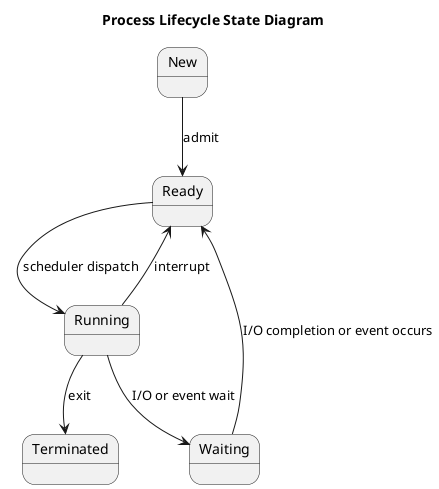

# Process States 🖥️

A **process** is an instance of a program in execution. Throughout its life, a process transitions between various states, which define its current activity. Understanding these states is fundamental to comprehending how an operating system manages multiple tasks and allocates CPU time.

---

### Process State Diagram
The following diagram illustrates the common transitions a process makes between its primary states.

!

---

### Common Process States

| State | Description | Example |
| :--- | :--- | :--- |
| **New** | The process is being created and is not yet in a ready state. The OS allocates resources such as a Process Control Block (PCB). | A user double-clicks on an application icon. |
| **Ready** | The process is loaded into main memory and is ready to run, but the CPU is not available. It is waiting for the scheduler to select it. | A program that has finished loading and is waiting for its turn to execute on the CPU. |
| **Running** | The process's instructions are being executed by the CPU. At any given time, only one process can be in the running state per CPU core. | The CPU is actively executing a portion of your code, such as a calculation or a function call. |
| **Waiting (or Blocked)** | The process is waiting for some event to occur, such as the completion of an I/O operation (e.g., reading a file) or a signal from another process. It cannot run until the event happens. | A program waiting for the user to press a key or for data to be retrieved from a disk. |
| **Terminated** | The process has finished its execution. The OS de-allocates its resources, although its PCB may be retained for a short period for accounting or debugging purposes. | A program finishes running and exits gracefully. |

---

### State Transitions

* **New → Ready:** The OS has finished creating the process and places it in the ready queue.
* **Ready → Running:** The scheduler selects the process from the ready queue and dispatches it to the CPU.
* **Running → Ready:** This is a transition caused by a time slice expiration (a preemptive context switch). The process is moved back to the ready queue to wait for its next turn.
* **Running → Waiting:** The process initiates an event, such as an I/O request, and must wait for it to complete.
* **Waiting → Ready:** The event the process was waiting for has completed (e.g., I/O operation is finished), so it is moved back to the ready queue.
* **Running → Terminated:** The process finishes its execution, either normally or due to a fatal error.

